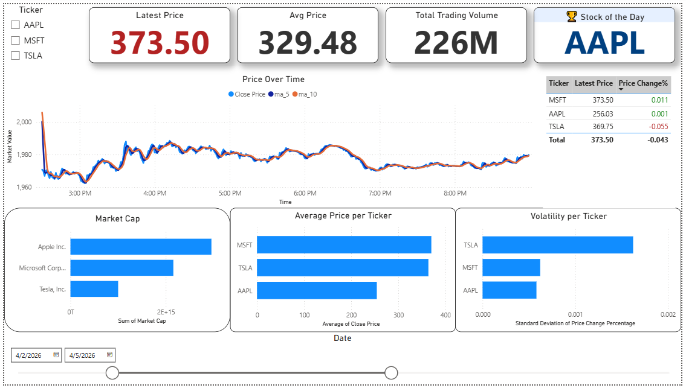
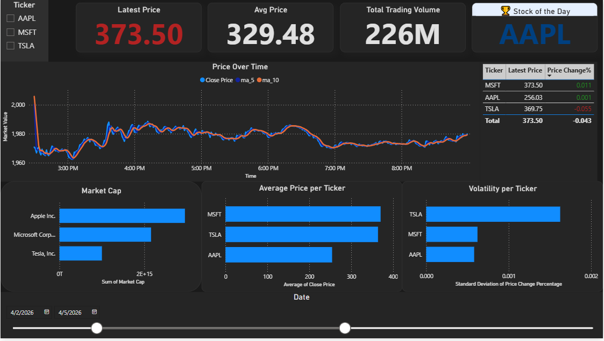

# 📈 Stock Market ETL Pipeline

A production-style data pipeline that extracts stock market data from Yahoo Finance, loads it into a PostgreSQL data warehouse, and transforms it into a star schema for analytics and visualization in Power BI.

---

## 🚀 Project Overview

This project simulates a real-world data engineering workflow:

* Extracts stock data (e.g., TSLA, AAPL, MSFT)
* Stores raw data in a staging layer
* Transforms into analytical tables (Fact + Dimensions)
* Visualizes data in dashboards
* Supports orchestration via Apache Airflow

---

## 🏗️ Architecture

```
Yahoo Finance API (yfinance)
    ↓
Python Ingestion Script
    ↓
PostgreSQL (Staging)
    ↓
Transformation Layer (SQL)
    ↓
Star Schema (Fact + Dimensions)
    ↓
Power BI Dashboard
    ↓
Airflow / Python Orchestration
```

---

## 🛠️ Tech Stack

* Python 3.10
* PostgreSQL
* SQLAlchemy
* yfinance
* Apache Airflow
* Power BI

---

## ⚙️ Installation & Setup

### ✅ Prerequisites

* Python 3.10+
* PostgreSQL installed and running
* Git

---

### 1️⃣ Clone the Repository

```bash
git clone https://github.com/your-username/stock-etl-pipeline.git
cd stock-etl-pipeline
pip install -r requirements.txt
```

---

### 2️⃣ Database Setup

Open PostgreSQL (pgAdmin or psql)

```sql
CREATE DATABASE finance_db;
```

Run SQL scripts:

* `sql/create_tables.sql`
* `sql/dim_tickers.sql`

---

### 3️⃣ Configure Database Connection

Update `scripts/db.py`:

```python
user = "postgres"
password = "your_password"
host = "localhost"
port = "5432"
db_name = "finance_db"
```

---

## ▶️ Running the Pipeline

### 🔹 Option A — Manual Execution

```bash
py scripts/ingestion.py
py scripts/load_to_postgres.py
py scripts/transform.py
```

---

### 🔹 Option B — Automated with Airflow (Windows)

```bash
set AIRFLOW_HOME=D:/Data-Engineering-Project/airflow
set AIRFLOW__DATABASE__SQL_ALCHEMY_CONN=sqlite:////D:/Data-Engineering-Project/airflow/airflow.db
```

Initialize:

```bash
py -3.10 -m airflow db init
```

Run:

```bash
py -3.10 -m airflow webserver --port 8080
py -3.10 -m airflow scheduler
```

Open in browser:

```
http://localhost:8080
```

Trigger DAG: `stock_etl_pipeline`

---

### 🔹 Option C — One-Click Python Pipeline

```bash
py run_etl.py
```

---

### 🧩 What `run_etl.py` Does

* Fetches data from Yahoo Finance
* Loads data into PostgreSQL
* Creates dimension tables
* Transforms data into fact table

✔ Stops execution if any step fails
✔ Logs each stage

---

## 📂 Dataset

Raw stock market CSV files are stored in:

data/raw/


These files are used as the source for ingestion and can be inspected or modified locally.

---

## 📊 Data Model (Star Schema)

The project follows a **star schema design**, separating transactional stock data from descriptive company metadata.

---

### 🧾 Fact Table — `fact_stock_prices`

Stores time-series stock market data enriched with calculated metrics.

**Key Columns:**

* datetime → Timestamp of the stock record
* ticker → Stock symbol (FK to dim_ticker)
* open_price, high_price, low_price, close_price
* volume
* price_change, price_change_pct
* ma_5, ma_10

**Additional Attributes:**
Includes metadata such as market_cap, exchange, and ingestion_time.

---

### 📌 Dimension Table — `dim_ticker`

Contains descriptive information about each stock ticker.

**Key Columns:**

* ticker (Primary Key)
* company_name
* sector, industry
* country
* exchange

---

### 🔗 Relationship

* `fact_stock_prices.ticker → dim_ticker.ticker`
  (One-to-Many relationship)

---

## 📊 Power BI & Analytics Layer

The final stage of the pipeline is a **Power BI dashboard** connected to PostgreSQL, enabling interactive analysis of stock performance.

---

### 📈 Key Measure (DAX)

```DAX
Latest Price = LASTNONBLANK('public fact_stock_prices'[close_price], 1)
```

This measure ensures the latest available closing price is shown even when markets are closed.

---

### ⚙️ Business Logic

* Handles non-trading days (weekends/holidays)
* Uses PostgreSQL `public` schema
* Enables dynamic filtering by ticker

---

## 🎨 Dashboard Preview

### 🌞 Light Mode



### 🌙 Dark Mode



---

## 📊 SQL Analytics & Insights

### 📈 Top Volatile Stocks

```sql
SELECT ticker, STDDEV(price_change_pct) AS volatility
FROM fact_stock_prices
GROUP BY ticker
ORDER BY volatility DESC;
```
## 📊 Business Insights

The pipeline enables analysis of stock performance and market behavior. Key insights include:

- 📈 **Volatility Analysis:**  
  Certain stocks exhibit significantly higher volatility, making them suitable for short-term trading strategies.

- 💰 **Market Leaders:**  
  Companies with the highest market capitalization dominate the dataset, indicating strong market presence and investor confidence.

- 📉 **Price Trends:**  
  Moving averages (MA_5, MA_10) help identify short-term trends and potential momentum shifts.

- ⏱️ **Latest Market Snapshot:**  
  The system always reflects the most recent valid closing price, ensuring accurate reporting even during non-trading days.

---

### 💰 Latest Price Snapshot

```sql
SELECT DISTINCT ON (ticker)
    ticker,
    datetime,
    close_price
FROM fact_stock_prices
ORDER BY ticker, datetime DESC;
```

---

## 💡 Key Features

### ✅ Modular Design

Separate scripts for ingestion, loading, and transformation

### ✅ Idempotent Pipeline

Safe to re-run without duplicating data

### ✅ Multiple Execution Modes

* Manual execution
* Python orchestration (`run_etl.py`)
* Airflow DAG

### ✅ Scalable Architecture

Easily extendable to more tickers, APIs, and cloud platforms

### ✅ Orchestration Ready

Includes DAG for scheduling and monitoring

---

## ⚠️ Challenges & Learnings

This project was developed in a Windows environment, which introduced challenges:

* Airflow SQLite configuration issues
* Environment variable setup
* File path compatibility

💡 **Solution:**
Built a flexible execution model:

* Manual pipeline
* Python orchestration
* Airflow DAG

---

## 🔮 Future Improvements

* Add Docker support
* Deploy Airflow on cloud (AWS/GCP)
* Replace SQLite with PostgreSQL for Airflow metadata DB
* Add real-time streaming (Kafka)

---

## 📌 Conclusion

This project demonstrates:

* End-to-end ETL pipeline design
* Data warehousing concepts (star schema)
* Workflow orchestration
* Real-world debugging and environment handling